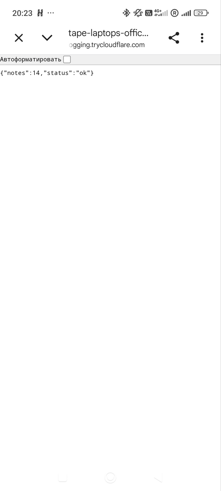
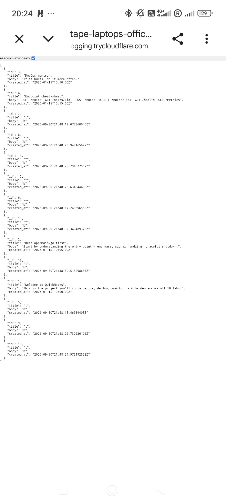

# Lab 10. Cloud Computing

## New workflow ```release.yml```

At first, i collected the latest versions of the required third-party actions and their SHAs
```
gh release view --repo docker/login-action --json tagName --jq .tagName
gh release view --repo docker/build-push-action --json tagName --jq .tagName
gh release view --repo docker/metadata-action --json tagName --jq .tagName
gh release view --repo docker/setup-buildx-action --json tagName --jq .tagName

v4.6.0
v7.4.0
v6.2.0
v4.4.1
```


```
gh api repos/docker/login-action/commits/v4.6.0 --jq .sha
gh api repos/docker/build-push-action/commits/v7.4.0 --jq .sha
gh api repos/docker/metadata-action/commits/v6.2.0 --jq .sha
gh api repos/docker/setup-buildx-action/commits/v4.4.1 --jq .sha

dbcb813823bdd20940b903addbd779551569679f
c3c9e263c25d99ce0380d002d59b67737d91b0dc
dc802804100637a589fabce1cb79ff13a1411302
f87e5991a6d7451dcb8d9637bfbc97413f497069
```

Then the new workflow [release.yml](../.github/workflows/release.yml) was created

### Making the tag and pushing it
```
git tag -a -s v0.1.0 -m "Lab 10 release"
git push origin v0.1.0
```

URL of a successfull CI-release run: https://github.com/Salamer2/DevOps-Intro/actions/runs/37662313313/job/112932655134 \
Registry URL: ```ghcr.io/salamer2/devops-intro/quicknotes:v0.1.0```


### Pulling the image
The image was successfully pulled.
```
thebruh@thebruh-PC MINGW64 ~/Desktop/DevOpsCourse/DevOps-Intro (feature/lab10)
$ docker pull ghcr.io/salamer2/devops-intro/quicknotes:v0.1.0
v0.1.0: Pulling from salamer2/devops-intro/quicknotes
44136fa355b3: Already exists
47d9538611fa: Pull complete
91d42874255a: Pull complete
d25c7cef9286: Pull complete
481d14300ae4: Pull complete
3b9cd641a3a7: Download complete
Digest: sha256:008a15d3924234476621597bc4da1c753baa472b145e2120c156851bb7d6abb1
Status: Downloaded newer image for ghcr.io/salamer2/devops-intro/quicknotes:v0.1.0
ghcr.io/salamer2/devops-intro/quicknotes:v0.1.0
```

### Design questions

#### a) OIDC vs GITHUB_TOKEN — for pushing to ghcr.io from the same repo, GITHUB_TOKEN with packages: write is enough. When would you reach for OIDC instead, and what does it give you that GITHUB_TOKEN doesn't?
OICD is required when pushing to the external cloud providers, because it is standartized. While GITHUB_TOKEN is made for github only, and cloud providers may not know what to do with it. The main advantage of using OIDC is safety for pushing to external clouds. It allows short-lived and secure access, therefore it eliminates storing any long-living secrets.
#### b) :latest tag vs :v0.1.0 immutable tag — Lab 6 covered why :latest is mutable. So why do you still ship a :latest tag alongside the immutable one in production releases?
Because in this case :latest is made for consumer convenience. Most of the times, consumers don't need reproducibility at all, they just want a latets working version. In the other time, immutable tags are made for deterministic deploys that requre a higher level of reliability.
#### c) packages: write scope only — what's the principle, and what concrete attack does the narrow scope prevent vs write: all?
With `write:all`, possible hacker gains access to the whole repository. They will be able to control any code, create malicious releases, read secrets, etc. Meanwhile, `packages: write` narrows the attack possibility. Hacker will be able to mess with the current image, but won't be able to spread to the whole repo.

## Task 2

### Render and Codespaces. Which on i used and why
I used GitHub Codespaces. Render requres a card to use. International payment systems and processing networks are disconnected from Russian financial institutions, that's the reason why i picked Codespaces.

### Devcontainer
```json
{
  "name": "quicknotes-host",
  "image": "mcr.microsoft.com/devcontainers/base:ubuntu-24.04",
  "features": {
    "ghcr.io/devcontainers/features/docker-in-docker:2": {}
  },
  "forwardPorts": [8080],
  "postCreateCommand": "docker pull ghcr.io/salamer2/devops-intro/quicknotes:v0.1.0",
  "postStartCommand": "docker rm -f quicknotes 2>/dev/null; docker run -d --name quicknotes -p 8080:8080 ghcr.io/salamer2/devops-intro/quicknotes:v0.1.0"
}
```

### Service URL
https://jubilant-space-journey-gjq56rrj6jwcpp67-8080.app.github.dev

### curl health check
```
$ curl -v https://jubilant-space-journey-gjq56rrj6jwcpp67-8080.app.github.dev/health
* Host jubilant-space-journey-gjq56rrj6jwcpp67-8080.app.github.dev:443 was resolved.
* IPv6: (none)
* IPv4: 20.125.70.28
*   Trying 20.125.70.28:443...
* schannel: disabled automatic use of client certificate
* ALPN: curl offers http/1.1
* ALPN: server accepted http/1.1
* Established connection to jubilant-space-journey-gjq56rrj6jwcpp67-8080.app.github.dev (20.125.70.28 port 443) from 172.18.0.1 port 53403
* using HTTP/1.x
> GET /health HTTP/1.1
> Host: jubilant-space-journey-gjq56rrj6jwcpp67-8080.app.github.dev
> User-Agent: curl/8.18.0
> Accept: */*
>
* Request completely sent off
* schannel: remote party requests renegotiation
* schannel: renegotiating SSL/TLS connection
* schannel: SSL/TLS connection renegotiated
* schannel: remote party requests renegotiation
* schannel: renegotiating SSL/TLS connection
* schannel: SSL/TLS connection renegotiated
< HTTP/1.1 200 OK
< Date: Wed, 07 Oct 2026 20:19:13 GMT
< Content-Type: application/json
< Content-Length: 26
< Connection: keep-alive
< Cache-Control: no-cache,no-store
< Cache-Control: no-store
< Expires: Thu, 01 Jan 1970 00:00:00 GMT
< Pragma: no-cache
< Set-Cookie: .Tunnels.Relay.WebForwarding.Cookies=CfDJ8NJJuTEdEi5KqensronCVW0wmBGwmfmJrFiHIwbHY1Vnex4_drtD70bmSDyxBojp-RXs8cY0VTUlrXRKv4V_03SERkvcyFeu07J6tVliktaaEFNzJrZn4tFlA9li3yqJMfeY7jv8KwK_5vkTH-6Kl84KcTTeNT__kmkTtMv0nLeUTwjcxd_4z1t8Ha8Jln-iP7UI6oIPg6Yagx5Mh2JbVvTI4Iazk4zkVCDp3LZJuH-4f2xbu2yM4KOukFNlOObsgZYOmjFS6XQ0OF8_M_O7gFTdwWSxt_k1WsaYYYIKR0Ia7Rln17S2jEazYS3pVB9uT_DPz4IBqkwsGayu8zr0WNlkyMFzJzAoBRtq_w3maV-mgBS7QKMk5Sk6Y-2Fs9QdPVrDaGGSfIVf2EjzhvKsMtNkx85YYDqviZDNgsnVvSA7xpF-4moRp3Z3JX76jaRUPhaRpPadg-HmpXEchuGtluZDH1i9A6qAKY75hI4lG_9UiDQ9fq3EFudCtKAyxNkHO9o_9Lpd4RJ1h4qtYdDKgTVvboNp39_a_0qbku7aSljk-Xki7te6pX_AWOGP0liEm7d1z_cV6MC7vBzUS0T71iCLrJidwVNOsgLeNytt1uaYS7RRvN7uX8SO3EF9RO3CFomfo0sUz2G0lgT5XTERz2YLblbk_DgwJO9RCMcgzUmYVKYRU-rEnMZ4Je8mzwGQ8BKvmuSQNida-gzIyy4EjhETRJP1hR1vtfP2vXtxrtRsDceay7ZdNVYZlPOB3ZBBI--l--8b51CKloDC8LcmI0hML_swPAVNiEcsvLIgE4IQqgjqctldpXEqXzPLvCdiAhy7XXjXtpMryz_imvpvD0HebAm5GXR4yUayeZDpjAfRFlLJ-BpmwUj9vymyPfcHvLAHJ8pImi4yZnjPOJVac282d0PoVNLlHAdLQ73gGMeNEPiMyW2KT8bqk3U4rtK1KRwxaeRszzpGS9IGhfhVm2N1QCFKu2s3xfESxdqPNdNo; path=/; secure; samesite=none; Partitioned
< X-Content-Type-Options: nosniff
< RateLimit-Limit: HttpRequestRatePerPort:1500/m
< RateLimit-Remaining: HttpRequestRatePerPort:1499
< RateLimit-Reset: HttpRequestRatePerPort:14s
< X-Report-Abuse: https://msrc.microsoft.com/report/abuse
< x-ms-ratelimit-limit:
< x-ms-ratelimit-remaining:
< x-ms-ratelimit-used: 1
< x-ms-ratelimit-reset:
< vssaas-request-id: 95f9e591-f643-4450-b1f7-91bc8c58fa9a
< Strict-Transport-Security: max-age=31536000; includeSubDomains
< X-Served-By: tunnels-prod-rel-usw3-v3-cluster
< X-Robots-Tag: noindex, nofollow
< Referrer-Policy: same-origin
<
{"notes":0,"status":"ok"}
* Connection #0 to host jubilant-space-journey-gjq56rrj6jwcpp67-8080.app.github.dev:443 left intact
```

### Opening the ports
```
thebruh@thebruh-PC MINGW64 ~/Desktop/DevOpsCourse/DevOps-Intro (feature/lab10)
$ gh codespace ports visibility 8080:public -c jubilant-space-journey-gjq56rrj6jwcpp67

thebruh@thebruh-PC MINGW64 ~/Desktop/DevOpsCourse/DevOps-Intro (feature/lab10)
$ gh codespace ports -c jubilant-space-journey-gjq56rrj6jwcpp67
LABEL  PORT  VISIBILITY  BROWSE URL
       8080  public      https://jubilant-space-journey-gjq56rrj6jwcpp67-8080.app.github.dev
```

### Warm latency
```
@Salamer2 ➜ /workspaces/DevOps-Intro (feature/lab10) $ for i in 1 2 3 4 5; do curl -w "%{time_total}\n" -o /dev/null -s https://jubilant-space-journey-gjq56rrj6jwcpp67-8080.app.github.dev/health; done
0.195186
0.143900
0.045184
0.201181
0.149511
```
p50 is ```0.149511```


### Cold latency:
Run 1:
```
thebruh@thebruh-PC MINGW64 ~/Desktop/DevOpsCourse/DevOps-Intro (feature/lab10)
$ gh codespace stop -c jubilant-space-journey-gjq56rrj6jwcpp67

thebruh@thebruh-PC MINGW64 ~/Desktop/DevOpsCourse/DevOps-Intro (feature/lab10)
$ date +%s
1791403878

thebruh@thebruh-PC MINGW64 ~/Desktop/DevOpsCourse/DevOps-Intro (feature/lab10)
$ curl -v https://jubilant-space-journey-gjq56rrj6jwcpp67-8080.app.github.dev/health
* Host jubilant-space-journey-gjq56rrj6jwcpp67-8080.app.github.dev:443 was resolved.
* IPv6: (none)
* IPv4: 20.125.70.28
*   Trying 20.125.70.28:443...
* schannel: disabled automatic use of client certificate
* ALPN: curl offers http/1.1
* ALPN: server accepted http/1.1
* Established connection to jubilant-space-journey-gjq56rrj6jwcpp67-8080.app.github.dev (20.125.70.28 port 443) from 172.18.0.1 port 61896
* using HTTP/1.x
> GET /health HTTP/1.1
> Host: jubilant-space-journey-gjq56rrj6jwcpp67-8080.app.github.dev
> User-Agent: curl/8.18.0
> Accept: */*
>
* Request completely sent off
* schannel: remote party requests renegotiation
* schannel: renegotiating SSL/TLS connection
* schannel: SSL/TLS connection renegotiated
* schannel: remote party requests renegotiation
* schannel: renegotiating SSL/TLS connection
* schannel: SSL/TLS connection renegotiated
< HTTP/1.1 200 OK
< Date: Wed, 07 Oct 2026 20:12:43 GMT
< Content-Type: application/json
< Content-Length: 26
< Connection: keep-alive
< Cache-Control: no-cache,no-store
< Cache-Control: no-store
< Expires: Thu, 01 Jan 1970 00:00:00 GMT
< Pragma: no-cache
< Set-Cookie: .Tunnels.Relay.WebForwarding.Cookies=CfDJ8NJJuTEdEi5KqensronCVW1tZdHGvU-kazgJO24LELADEytcRRcFh-oSpa4Uw-ksI_-N6gRcLFDtuFY-bclt1k_CNLbWZEAoxXN0uIKgTGK4MoaVud5SFlIIz_5P6vYLk0JdgYFUSKxct1z4f2LflUu26vgpjYvhyK5Vj1BHBwNgQIjiDXe4uyRwvHbah3VaOPzukncl8zG73FdILwt1fK_JjN5SjsgzRgfC7ccyx75PBCnfeukvMl3E0Z-YY76ZHynwFOrHR-T2K5wg-o5D0RWXHUsvh-WSz7aMRBfv1z7o3cqt_KBQRRI2VIBj0LAhnH24rCtZlbgebLmLeKBLAx6U22iZYOPQ0v5DshNjysn_ztYWkqi6OG1_ZSR1wwH2BfYR6fifMGCRur4ftvw83_D0rTaPzjXG9qsiydslb2VNnRG9N9H_Kbwy2ckWCwFdwt01unHMyPNXl6nj0D9yfr7ayt8q80YMBSuvPtBDW1znJlJVvDDvgOkGzzqgmBSxnlFU58OWu3FcPuKV1eAzMoRR2iw20y5azHa6hh99E5726YBsewEoTPL_vov_4FMw_OaptsJH8hz7NBA8LuQfUmWD_R_R5K59fQS2AtXYx71v7GibqSY3FRT3DBWJ0uxiRjVGN18I7W0gQ2uD91_cYGvgijrpWvUM_O7SQQbdxhGdW6IIG_nkREAHgLKBEwoRF8abzzOoJlBO24bJYnXxlpNK0HJzCosF24mbatyRITDO0oXsXZz-dlUy_L6vRNR2SS_h9I9EZLFLHaqwB27Nd87j-fsXDrnEyym0-Vql0gx8W0ViMQXgRaG6fZ6Y3tbNURSg0XMycRc6ZC2uKthlB6EA9A3Ondw0gltHydurS88Wy30AQmxgGVIINYUxgdgtCZxFEG-EsYR2ZqX82AjDrtMXuOepSuMrPo7NGW_2kvVSQ-J154lZpkg7loe9Vt3cGVUFg_eYp_bEpVjzoAOpZM7v7N6C9OwGHeatdVzaNY66; path=/; secure; samesite=none; Partitioned
< X-Content-Type-Options: nosniff
< RateLimit-Limit: HttpRequestRatePerPort:1500/m
< RateLimit-Remaining: HttpRequestRatePerPort:1499
< RateLimit-Reset: HttpRequestRatePerPort:21s
< X-Report-Abuse: https://msrc.microsoft.com/report/abuse
< x-ms-ratelimit-limit:
< x-ms-ratelimit-remaining:
< x-ms-ratelimit-used: 1
< x-ms-ratelimit-reset:
< vssaas-request-id: 48327a29-d35e-4967-aba9-482a85582a5b
< Strict-Transport-Security: max-age=31536000; includeSubDomains
< X-Served-By: tunnels-prod-rel-usw3-v3-cluster
< X-Robots-Tag: noindex, nofollow
< Referrer-Policy: same-origin
<
{"notes":0,"status":"ok"}
* Connection #0 to host jubilant-space-journey-gjq56rrj6jwcpp67-8080.app.github.dev:443 left intact

thebruh@thebruh-PC MINGW64 ~/Desktop/DevOpsCourse/DevOps-Intro (feature/lab10)
$ date +%s
1791403964
```
Start time: 86s


Run 2:
```
thebruh@thebruh-PC MINGW64 ~/Desktop/DevOpsCourse/DevOps-Intro (feature/lab10)
$ gh codespace stop -c jubilant-space-journey-gjq56rrj6jwcpp67

thebruh@thebruh-PC MINGW64 ~/Desktop/DevOpsCourse/DevOps-Intro (feature/lab10)
$ date +%s
1791404069

thebruh@thebruh-PC MINGW64 ~/Desktop/DevOpsCourse/DevOps-Intro (feature/lab10)
$ curl -v https://jubilant-space-journey-gjq56rrj6jwcpp67-8080.app.github.dev/health
* Host jubilant-space-journey-gjq56rrj6jwcpp67-8080.app.github.dev:443 was resolved.
* IPv6: (none)
* IPv4: 20.125.70.28
*   Trying 20.125.70.28:443...
* schannel: disabled automatic use of client certificate
* ALPN: curl offers http/1.1
* ALPN: server accepted http/1.1
* Established connection to jubilant-space-journey-gjq56rrj6jwcpp67-8080.app.github.dev (20.125.70.28 port 443) from 172.18.0.1 port 57228
* using HTTP/1.x
> GET /health HTTP/1.1
> Host: jubilant-space-journey-gjq56rrj6jwcpp67-8080.app.github.dev
> User-Agent: curl/8.18.0
> Accept: */*
>
* Request completely sent off
* schannel: remote party requests renegotiation
* schannel: renegotiating SSL/TLS connection
* schannel: SSL/TLS connection renegotiated
* schannel: remote party requests renegotiation
* schannel: renegotiating SSL/TLS connection
* schannel: SSL/TLS connection renegotiated
< HTTP/1.1 200 OK
< Date: Wed, 07 Oct 2026 20:15:23 GMT
< Content-Type: application/json
< Content-Length: 26
< Connection: keep-alive
< Cache-Control: no-cache,no-store
< Cache-Control: no-store
< Expires: Thu, 01 Jan 1970 00:00:00 GMT
< Pragma: no-cache
< Set-Cookie: .Tunnels.Relay.WebForwarding.Cookies=CfDJ8NJJuTEdEi5KqensronCVW3A6h49HlTKWZRXZ5pIk6lojrlALfLO4EiGfxbRjjULmSf8E7HgbXucILLIQijyxGLR5sNXRyw-8Squ0aDFqfbBuvzHPPRx6zjeHduGKP5rbcI4RBd-tqfvuArJz45lgYKZr18Ac8QrOHCBCu1jWu1wfAWsIreqfUVOtB7lmZHi_hdxQsX715_IeZIEcDXTNFDOStR2UbMzYVUGZfF3zGIBepJe3orf5a6Kznxb_QjtTBkTX1FgOGESSuqE9Y3GeMA5RoxY3TDp64v7OJ0knTCcv9YQYMGEkrimPaI7KJaEn4Xso535Ewv0vUxGTLqh8y_p_tQRhdlyGmdsYFJJhR7GnZ0wXcaTlB-_kMlqOT2p05nLohibmIyDGdyVczp4l_GBkiWVByttQwHYuHAvkgKpdfg81mbIzRMFo4oqaKUBwt9dhbMCSZy4H1Rwm9-6j8KnlqqXa6MmClWQwaKc2UqqeCA08xvBJh5ES-zNrdiJSsX6szO82l4brysiHKGBIbjYQelQT85auQR6GTBa8bd9XuTtcwpFooZ0Q5UR7-KU0BFsPN5kG3_Mq_U4hCXdB1LgO5PTcjsWHSLlZDE-32XbS3lCvvK1M_dPbqr1jAK5R77ewU9VFoaZtsIWk8_j8mtllBcNuiXYZDxduAAUVyden6VJ8LwqIHtHNjzP547iHQHFNg0yx1X8_ThrQisLDF9eLjoNy64KqsVoVqi79aoAqv5Ippx2oZD4vwyBBomBmA8wQm1eJRx8kGVjINcWD0c5SORTF_p02YBRaxRtgAbSw72kd8Ln5GRdENpWCBXO8vETLr27t4klXlyxciUsvNR3UN8ytt3h1BiZbb1IN8q0iUYOUoR4LQRHeAimq09vNHC4dxS5-hfqHnIKYL2pflkyZXMradbAoka0SEkZioBlBTTj6PSeUnmRwWHlJNDwiAIwfCDRxGNEyYxLzxg-_DBpQLhvKEHQzjaMOAXrE7P7bIEkGvMa7b9h4tOUe5H2Mw; path=/; secure; samesite=none; Partitioned
< X-Content-Type-Options: nosniff
< RateLimit-Limit: HttpRequestRatePerPort:1500/m
< RateLimit-Remaining: HttpRequestRatePerPort:1499
< RateLimit-Reset: HttpRequestRatePerPort:3s
< X-Report-Abuse: https://msrc.microsoft.com/report/abuse
< x-ms-ratelimit-limit:
< x-ms-ratelimit-remaining:
< x-ms-ratelimit-used: 1
< x-ms-ratelimit-reset:
< vssaas-request-id: 0de01670-1219-4431-959c-e7856ad8bf08
< Strict-Transport-Security: max-age=31536000; includeSubDomains
< X-Served-By: tunnels-prod-rel-usw3-v3-cluster
< X-Robots-Tag: noindex, nofollow
< Referrer-Policy: same-origin
<
{"notes":0,"status":"ok"}
* Connection #0 to host jubilant-space-journey-gjq56rrj6jwcpp67-8080.app.github.dev:443 left intact

thebruh@thebruh-PC MINGW64 ~/Desktop/DevOpsCourse/DevOps-Intro (feature/lab10)
$ date +%s
1791404125
```
Start time: 56s

Run 3:
```
thebruh@thebruh-PC MINGW64 ~/Desktop/DevOpsCourse/DevOps-Intro (feature/lab10)
$ gh codespace stop -c jubilant-space-journey-gjq56rrj6jwcpp67

thebruh@thebruh-PC MINGW64 ~/Desktop/DevOpsCourse/DevOps-Intro (feature/lab10)
$ date +%s
1791404165

thebruh@thebruh-PC MINGW64 ~/Desktop/DevOpsCourse/DevOps-Intro (feature/lab10)
$ curl -v https://jubilant-space-journey-gjq56rrj6jwcpp67-8080.app.github.dev/health
* Host jubilant-space-journey-gjq56rrj6jwcpp67-8080.app.github.dev:443 was resolved.
* IPv6: (none)
* IPv4: 20.125.70.28
*   Trying 20.125.70.28:443...
* schannel: disabled automatic use of client certificate
* ALPN: curl offers http/1.1
* ALPN: server accepted http/1.1
* Established connection to jubilant-space-journey-gjq56rrj6jwcpp67-8080.app.github.dev (20.125.70.28 port 443) from 172.18.0.1 port 55542
* using HTTP/1.x
> GET /health HTTP/1.1
> Host: jubilant-space-journey-gjq56rrj6jwcpp67-8080.app.github.dev
> User-Agent: curl/8.18.0
> Accept: */*
>
* Request completely sent off
* schannel: remote party requests renegotiation
* schannel: renegotiating SSL/TLS connection
* schannel: SSL/TLS connection renegotiated
* schannel: remote party requests renegotiation
* schannel: renegotiating SSL/TLS connection
* schannel: SSL/TLS connection renegotiated
< HTTP/1.1 200 OK
< Date: Wed, 07 Oct 2026 20:16:59 GMT
< Content-Type: application/json
< Content-Length: 26
< Connection: keep-alive
< Cache-Control: no-cache,no-store
< Cache-Control: no-store
< Expires: Thu, 01 Jan 1970 00:00:00 GMT
< Pragma: no-cache
< Set-Cookie: .Tunnels.Relay.WebForwarding.Cookies=CfDJ8NJJuTEdEi5KqensronCVW2soHGiTGfSG_PVPr2SO7dGUFaqOlqmm6r8g_2dP7G0HfU7VJDGxRSGqvRBgW1g0uVFU60qyKMt_bIfte9_uUaMjhHV90PiEkMY4ySSqEhWC89p1lOdp_DkXaCb5clHG0tvBbSI-NVocy9zIVmfSPXZSSZaOLD4-13zjhJ0NRgULFLjB2GjwX1rlWsLR83Jkjoh6r7U9yW8JL092-ciBFx9rDXzKHHWGHvFM3GVid5pL-2QXddc132uQJdfiKrqOY5mduA7v-I4EiN8PME2PCJ2HFHKWJH2rrXeL9a9ySQkdHG7J7ZZDw2-6X4b3pbXARn_oKCtF6QvKvRZ79FDVzrPfwLWjdazngzG8fxXMex7NRsdMWtIrq0xVAEuik_-4ne6irNk_uIuLWGmEsPLVW3u-D5F0NtCXFJj9ueBFUl6V5Y5Y-UsIXgwS0_hBPi8OaXH8TS1nwHVFtnmUgBLYrJvmIF0ml39dAXdWvpE7BAmnvb5k7lwvWPmIOabE5l7-nUMseGbaVFpMxBu7cZBg5IWuvLXSmwPq_VKC8tiR0YmdD_jduGsF2p6nQyKFhtyDiNQQOaxpDJkdtYOQlH1lieO3J83TVn7178kUSXBdmyCuDpcxNAeZdAu-QyzcMNuOhXyWcDvOIx_reG2VP4VbfWO7cmGiMDI4fTM0US--WDyJ1rw28S51GkhBcS400_5ho3Rdtw8_v_1U03HHNaH03SKV159scBnbgAIcTpCZO1y9-G2rcg7Ba1i34ygB6sfbdi4bEe3MeZ03hTXqJozw5u2j8_69f14NwbP3kelR4FdW4jglq0SpNoi2a4f1j0vNfroRdwzoPhYaWgWY9agqfpeIx_7oVlms7uTbuLv3QGIrzdfgY84H5SE0dlyju5jKuiyU-RgVYh02BSnuNwOdGJPZDW5gqtCdPx4y-YncBqosnsex9hxbSx2t6cK1mVRkMbSGMYR374yVIDRGduGfXkV; path=/; secure; samesite=none; Partitioned
< X-Content-Type-Options: nosniff
< RateLimit-Limit: HttpRequestRatePerPort:1500/m
< RateLimit-Remaining: HttpRequestRatePerPort:1499
< RateLimit-Reset: HttpRequestRatePerPort:5s
< X-Report-Abuse: https://msrc.microsoft.com/report/abuse
< x-ms-ratelimit-limit:
< x-ms-ratelimit-remaining:
< x-ms-ratelimit-used: 1
< x-ms-ratelimit-reset:
< vssaas-request-id: 88e6e741-64e2-406f-8210-cb786d93c437
< Strict-Transport-Security: max-age=31536000; includeSubDomains
< X-Served-By: tunnels-prod-rel-usw3-v3-cluster
< X-Robots-Tag: noindex, nofollow
< Referrer-Policy: same-origin
<
{"notes":0,"status":"ok"}
* Connection #0 to host jubilant-space-journey-gjq56rrj6jwcpp67-8080.app.github.dev:443 left intact

thebruh@thebruh-PC MINGW64 ~/Desktop/DevOpsCourse/DevOps-Intro (feature/lab10)
$ date +%s
1791404221
```
Start time: 56s

So, starting times were 56s, 56s and 86s. That's much higher than times in warm test.

### Persistence test:
#### Making a note
```
@Salamer2 ➜ /workspaces/DevOps-Intro (feature/lab10) $ curl -X POST -H "Content-Type: application/json" -d '{"title":"lab10","body":"persistence test"}' http://localhost:8080/notes
{"id":1,"title":"lab10","body":"persistence test","created_at":"2026-10-07T20:28:14.797446841Z"}
@Salamer2 ➜ /workspaces/DevOps-Intro (feature/lab10) $ curl http://localhost:8080/notes
[{"id":1,"title":"lab10","body":"persistence test","created_at":"2026-10-07T20:28:14.797446841Z"}]
@Salamer2 ➜ /workspaces/DevOps-Intro (feature/lab10) $ 
```
#### Shutting down the codespace
```
thebruh@thebruh-PC MINGW64 ~/Desktop/DevOpsCourse/DevOps-Intro (feature/lab10)
$ gh codespace stop -c jubilant-space-journey-gjq56rrj6jwcpp67
```
#### After the launch:
```
@Salamer2 ➜ /workspaces/DevOps-Intro (feature/lab10) $ curl http://localhost:8080/notes
[]
```
Note disappeared. I explained in question `f` why.

### Design questions

#### d) a stopped codespace vs Render spin-down: which one wakes on a request, and why is that the line between a dev environment and a hosting platform? 
Render wakes up on a request. GitHub codespaces doesn't, it just returns an error code. The line exists because dev environment is not created to guarantee serving traffic at any moment, but just for existing during work. Meanwhile, hosting platforms designed to do exactly that - to guarantee serving traffic at any moment.

#### e) why do GitHub's terms forbid production hosting on Codespaces, and what would you need to add to QuickNotes on Codespaces to call it production?
Because again, it positions Codespaces as a tool for development. To make QuickNotes production ready, it must have persistent storage, wake-on-request function, things like monitoring or alerting, rate limiting and other functions. 

#### f) where did your note from step 5 go, and why is the answer different from Render's?
It was deleted. Becase the data was kept inside the container, after restart all data was removed, because Codespaces creates new container after each restart. Render will also delete the data, but for another reason, it has ephemeral filesystem and it would just wipe the disk.

## Bonus

First, a set up a cloudflared tunnel, then verified it from my phone on different network.




Then, from my laptop I did the measures using hyperfine (The cloudflare was launched on my PC, not laptop):
```
hyperfine --runs 50 --warmup 3 --export-json cs.json "curl -s -o NUL https://jubilant-space-journey-gjq56rrj6jwcpp67-8080.app.github.dev/health"
```
```
hyperfine --runs 50 --warmup 3 --export-json tunnel.json "curl -s -o NUL https://tape-laptops-office-blogging.trycloudflare.com/health"
```

### Hyperfine output files:
[cs.json](lab10-artifacts/cs.json) \
[tunnel.json](lab10-artifacts/tunnel.json)

### Comparison table

| Metric | Render / Codespace | Cloudflare Tunnel (local-via-edge) |
|--------|-------------------:|-----------------------------------:|
| Warm p50               |                  	0.6092 s |                                  0.4436 s |
| Warm p95               |                  1.0209 s |                                  0.5894 s |
| Cold start             |                  56 s |  N/A (continuously local)          |
| Public URL stability   |             stable |               ephemeral on restart |
| Cost                   |               free |                               free |

### Design questions

#### g) Architectural difference: on Render (or Codespaces) your container runs in someone else's datacenter; in Cloudflare Tunnel your container runs on your laptop and Cloudflare's edge proxies traffic in. Which one is "really cloud" — and does the distinction matter to your users?
"Really cloud" is Render and Codespaces. The service stored entirely on provider hardware that you don't own and don't maintain. Cloudflared just routes the internet traffic. For the user there is a small difference. Render and Codespaces are generally located in convenient traffic-dense physical spots, while Cloudflared forces the traffic to go from the user to the cloudflared server and then to exactly your machine, which can increase the response time. Besides that, users won't see any difference if they can reach the service.
#### h) Latency dominator for each: in the Render or Codespaces case, what's the slow part of warm latency? In the Tunnel case, what's the slow part?
For Tunnel the slow part is the long traffic route, as was described in g - the traffic must do this path: user -> cloudflared server - host machine and then back if the response is requred. In the Render or Codespaces case, the main latency is from reaching the servers directly.
#### i) When would Cloudflare Tunnel actually be the right production pick? (Hint: home labs, on-prem services exposed externally, dev URLs for stakeholder review.) When is it never the right pick?
As hint says, it's useful for the home-lab services that doesnt have white IP. It's good for on-prem services, where external access is a problem and must be strictly controlled. It's good for a local tools or dashboards that need to be shared externally. It's never okay for services that are sensitive to latency, for multiplayer games or services, when you need a strictly controlled traffic route.
