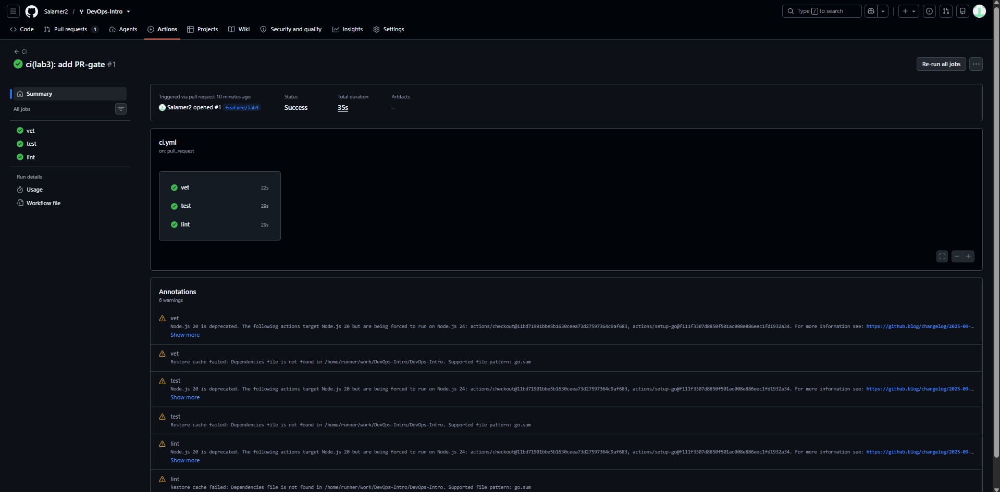
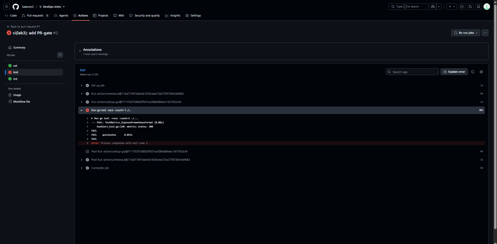
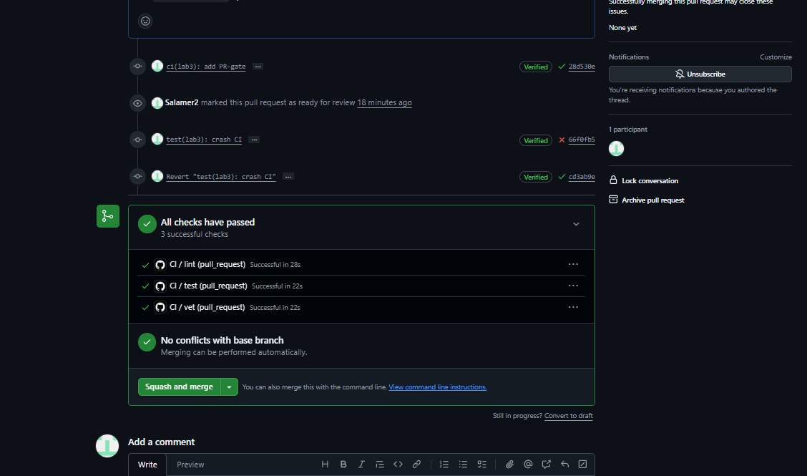
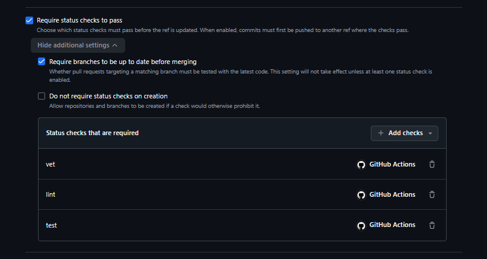

# Lab 3 Submission

Path: GitHub Actions. I picked it because I already did lab 1 and 2 in GitHub.

PR where lab 3 work was done: https://github.com/Salamer2/DevOps-Intro/pull/1

Succesfull CI run:



## Task 1 - PR Gate

I wrote `.github/workflows/ci.yml` with three jobs: vet, test and lint. All of them runing on `ubuntu-24.04`. Every action is pinned by full commit SHA with the tag in a comment. `permissions: contents: read` is set. The linter is pinned to v2.5.0.

### Proof that the gate works

Test was broken on purpose in `app/handlers_test.go`:



Broken commit: https://github.com/Salamer2/DevOps-Intro/pull/1/changes/66f0fb53f734c7f9f847d361c622ea44943e25eb

Then I reverted it with `git revert`:



Fix commit: https://github.com/Salamer2/DevOps-Intro/pull/1/changes/cd3ab9e7598ed94b545cb92aee5df3502bb0c787

### Branch protection

Succesfully added rules



### Design questions

**a) Why pin `ubuntu-24.04` instead of `ubuntu-latest`?**

`ubuntu-latest` can be changed at any time and that in theory could break a build, which is undesirable. Meanwhile `ubuntu-24.04` is stable.

**b) Why split vet + test + lint into separate units? What would happen with one combined job?**

Because they run in parallel, the total time is the longest job, which drastically improves runtime. Also, it 
is clearly visible what has broken. One combined job would stop when anything fails, and it will be required to search what exactly has failed.

**c) What attack does SHA pinning prevent?**

tj-actions/changed-files incident from March 2025. Attackers got write access to the action repo and force-pushed malicious code. Every workflow that used the tag ran the new code and leaked secrets into public logs. SHA, in the same time, always points at the same action that will never change

**d) What is `permissions:` and what is the principle behind it?**

Every workflow gets an automatic `GITHUB_TOKEN`. The `permissions:` block limits what this token can do. For example: `contents: read` is the least privilege. such CI can only read the code, so if some step gets compromised, the most harm will be that the attackers will read some files.

## Task 2 - Cache, Matrix, Path Filter

### Optimizations applied.

1. Cache:
```
cache: true
cache-dependency-path: app/go.sum
```
2. Matrix om Go 1.23 and 1.24 with `fail-fast: false` that runs vet and test.
3. Added ci-ok to the branch rules. After that, branch protection rules are not requred to be changed each time some job name changes.
4. Path filter. The workflow only triggers on changes in `app/**` or the CI file.

### Timing

Median of 5 runs each, measured with Re-run all jobs:

| Scenario | Wall-clock |
|----------|-----------|
| Baseline (no cache, single Go version, no path filter) | 35 s |
| With cache | 32 s |
| With cache + matrix | 44 s |

Raw numbers: baseline 35, 34, 66, 33, 54. Cache 32, 37, 28, 30, 32. Matrix+cache 44, 47, 43, 40, 62.

The cache row is ineffective since QuickNotes has zero third-party dependencies, so the cache has nothing to store. Most of the time is runner startup and `Run actions/setup-go`. The matrix slowed down the results since there are more jobs to do now. but since they run in parallel, time changes only slightly

### Design questions

**f) Why cache go.sum-keyed inputs and not build outputs?**

Inputs are deterministic, while builds depend on the compiler, environment and other variables. Binary files are useless on a different system too. Also, builds are usually much heavier than just raw text

**g) What does `fail-fast: false` change, and when do you want `true`?**

When `fail-fast: true` is set even one matrix fail will fail all other cells. You can't properly debug anything that way. When it is set to `False`, you can inspect which cell has failed and which has not. You would want to use `true`
when you care, that all cells must run succesfully, so when you see that some cell have failed, you go and fix it right away.

**h) What's the risk of an attacker writing a cache from a malicious PR**

CI runs on PR code and a malicious PR can write poisoned files into the cache. If a later build on a protected branch decides to load that cache, it compiles attacker code, which can lead to harmful consequences.
GitHub mitigates this with allowing run to read cache only from its own branch.

## Bonus - Performance Investigation

### Profile

| Job | Step | Time |
|-----|------|-----|
| test (1.23) | go test -race | 14 s |
| test (1.23) | setup-go | 10 s |
| test (1.24) | go test -race | 20 s |
| test (1.24) | setup-go | 2 s |
| vet (1.23) | go vet | 0 s |
| vet (1.23) | setup-go | 10 s |
| vet (1.24) | go vet | 6 s |
| vet (1.24) | setup-go | 1 s |
| lint | golangci-lint-action | 5 s |
| ci-ok | - | 0 s |

Additionally, checkout and job startup add approx 3s per job.

### Optimizations applied

1. `GOFLAGS=-buildvcs=false` on all jobs.
2. Linter binary cache.
3. Parallel job. vet, test and lint do not depend on each oth

### Before/after

| Optimization applied | Before | After | Saving |
|----------------------|-----------:|----------:|-------:|
| GOFLAGS=-buildvcs=false | 40-62 s | 41-50 s | 0, within noise |
| Linter binary cache | 40-62 s | 41-50 s | lint step 5 s to about 2 s on cache hit, total within noise |
| Parallel vet/test/lint graph | 40-62 s | 41-50 s | wall-clock is max not sum, already in place |
| **Total wall-clock** | **40-62 s** | **41-50 s** | **0** |

Results have shown, that the savings are inside the noise of runner startup, but 90s target is met.

### Bottleneck analysis

The remaining time is dominated by `go test -race`, which takes 14-20 s, and by setup-go on Go 1.23, which takes 10 s because that toolchain is not preinstalled on the runner image, unlike 1.24. The race detector instruments every memory access, so the test binary is slower to build and to run, and there is nothing to change in QuickNotes itself to fix that, the app is tiny and the tests take about a second without `-race`. One way would probably be dropping `-race`. I would stop optimizing already though. Current time is about 40-50s, and every further change will make the config harder to read for no practical gain.
