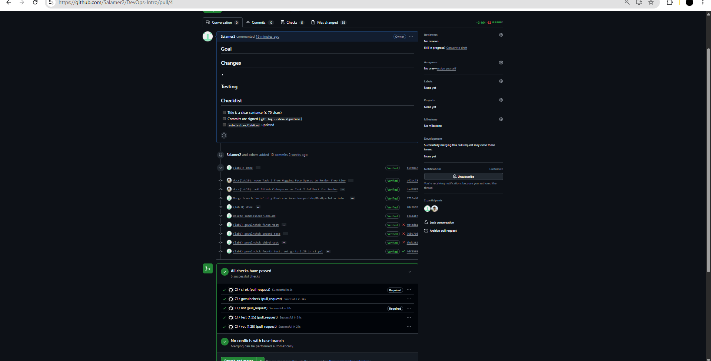
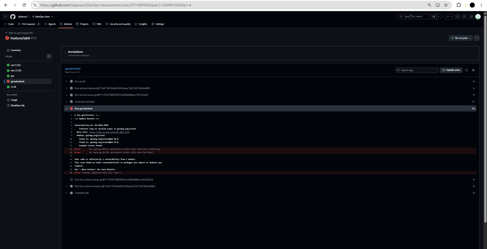
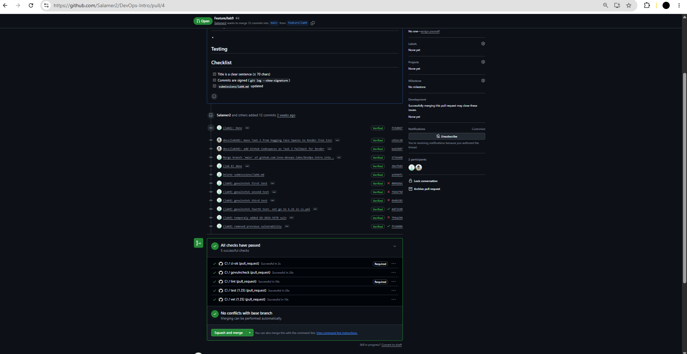

# Lab 9. DevSecOps

## Task 1. Trivy

### Image scan
#### Image scan before applying fixes:

```
quicknotes:lab6 (debian 13.7)
=============================
Total: 0 (HIGH: 0, CRITICAL: 0)

healthcheck (gobinary)
======================
Total: 19 (HIGH: 19, CRITICAL: 0)

quicknotes (gobinary)
=====================
Total: 19 (HIGH: 19, CRITICAL: 0)
```

#### Image scan after changing `go` version to `golang:1.26` in Dockerfile

```
quicknotes:lab9 (debian 13.7)
=============================
Total: 0 (HIGH: 0, CRITICAL: 0)
```

### Filesystem scan:

```
.vagrant/machines/default/virtualbox/private_key (secrets)
==========================================================
Total: 1 (HIGH: 1, CRITICAL: 0)

HIGH: AsymmetricPrivateKey (private-key)
```

### Config scan:

```
app/Dockerfile (dockerfile)
===========================
Tests: 28 (SUCCESSES: 26, FAILURES: 2)
Failures: 2 (UNKNOWN: 0, LOW: 1, MEDIUM: 1, HIGH: 0, CRITICAL: 0)
```

Full outputs are at [lab9-artifacts/](lab9-artifacts/).

### Triage

| Finding | Severity | Disposition | Reason |
|---------|----------|-------------|--------|
| 19 CVEs in ```Go v1.24.13```: CVE-2026-25679, CVE-2026-27145, CVE-2026-32280, CVE-2026-32281, CVE-2026-32283, CVE-2026-33811, CVE-2026-33814, CVE-2026-33818, CVE-2026-39820, CVE-2026-39821, CVE-2026-39822, CVE-2026-39836, CVE-2026-42499, CVE-2026-42504, CVE-2026-56853, CVE-2026-56858, CVE-2026-56859, CVE-2026-56860, CVE-2026-56862 | HIGH | FIX | Changed builder `golang:1.24` to `golang:1.26` in `app/Dockerfile`. After rescan warnings were fixed. |
| AsymmetricPrivateKey in `.vagrant/machines/default/virtualbox/private_key` | HIGH | FALSE POSITIVE | Temporary machine-generated key for Vagrant VM. Never committed|

### First 30 lines of SBOM.
The full file is [sbom.json](lab9-artifacts/sbom.json)

```json
{
  "$schema": "http://cyclonedx.org/schema/bom-1.6.schema.json",
  "bomFormat": "CycloneDX",
  "specVersion": "1.6",
  "serialNumber": "urn:uuid:f68eca85-50f0-49bc-b973-4e74b39ab921",
  "version": 1,
  "metadata": {
    "timestamp": "2026-10-05T20:56:13+00:00",
    "tools": {
      "components": [
        {
          "type": "application",
          "group": "aquasecurity",
          "name": "trivy",
          "version": "0.59.1"
        }
      ]
    },
    "component": {
      "bom-ref": "pkg:oci/quicknotes@sha256%3Af67a5b4b10b96e9e752ada45e69c9134f31544c6ecdd29092413c3f48790141a?arch=amd64&repository_url=index.docker.io%2Flibrary%2Fquicknotes",
      "type": "container",
      "name": "quicknotes:lab6",
      "purl": "pkg:oci/quicknotes@sha256%3Af67a5b4b10b96e9e752ada45e69c9134f31544c6ecdd29092413c3f48790141a?arch=amd64&repository_url=index.docker.io%2Flibrary%2Fquicknotes",
      "properties": [
        {
          "name": "aquasecurity:trivy:DiffID",
          "value": "sha256:187cfc6d1e3e8a40a5e64653bcd3239c140807dcf1c09e48021178705a5a6139"
        },
        {
          "name": "aquasecurity:trivy:DiffID",
```

### Design questions

#### a) CVE severity is one input, not the answer. What else (reachability, exploit availability, deployment context) matters when triaging?
Severity score is estimated based on worst-case scenario. In reality, it matters if the vulnerable code is reachable at all. In the QuickNotes, for example, almost all HIGH vulnerabilities are not reachable. Exploit availability is a factor too, if the exploit is just possible in theory, it is not as important as a published working exploit. Deployment context also changes the severity. On a local network the risk is much lower than in a public network.

#### b) Distroless images often show zero HIGH/CRITICAL. Why is the minimal base the strongest single security control?
Distroless contains almost nothing but binary and a few minimal files. There is almost nothing to exploit and patch. Even if the app is hacked, there is literally no shell so the attack is almost impossible to escalate.

#### c) .trivyignore lets you suppress findings. When is that the right move, and when is it security theater?
It's the right move when you actually analyzed the finding and understood that it is a false alarm or postponed the fix with a documented reason for such decision. It is not fine when you just ignore everything because of laziess just to deploy as fast as possible.
#### d) The SBOM is a list of components. What concrete future problem does having it today solve? (Hint: Log4Shell, Lecture 9.)
With SBOM you have a convenient list of components for each image. For example, if in future some vulnerability is being published, it is very simple to check which images are affected and fix them. The same thing was said in the Log4Shell example, where companies with SBOM fixed the exposure within some hours, while for companies without it, it took up to several weeks.

## Task 2. OWASP ZAP

### Scan

ZAP baseline 2.16.1 against `http://host.docker.internal:8080`.
Reports: [zap-before.html](lab9-artifacts/zap-before.html), [zap-before.json](lab9-artifacts/zap-before.json), [zap-after.html](lab9-artifacts/zap-after.html), [zap-after.json](lab9-artifacts/zap-after.json).

### Triage

| ID | Name | Risk | URL | Disposition | Reason |
|----|------|------|-----|-------------|--------|
| 10116 | ZAP is Out of Date | Low | /sitemap.xml | FALSE POSITIVE | Finding about the scanner itself. ZAP is pinned to 2.16.1 as in the lab, so it's not important now. |
| 10049 | Storable and Cacheable Content | Informational | /, /sitemap.xml | FIX | Added `Cache-Control: no-store` via middleware. Re-scan confirms the finding is gone. |

### Fix

The code change is included in this commit:

```diff
--- a/app/handlers.go
+++ b/app/handlers.go
+func noStore(next http.Handler) http.Handler {
+	return http.HandlerFunc(func(w http.ResponseWriter, r *http.Request) {
+		w.Header().Set("Cache-Control", "no-store")
+		next.ServeHTTP(w, r)
+	})
+}

--- a/app/main.go
+++ b/app/main.go
 	server := NewServer(store)
 	srv := &http.Server{
 		Addr:              addr,
-		Handler:           server.Routes(),
+		Handler:           noStore(server.Routes()),
 		ReadHeaderTimeout: 5 * time.Second,
 	}

--- a/app/handlers_test.go
+++ b/app/handlers_test.go
+func TestNoStoreHeader(t *testing.T) {
+	srv := newTestServer(t)
+	req := httptest.NewRequest(http.MethodGet, "/health", nil)
+	rec := httptest.NewRecorder()
+	noStore(srv.Routes()).ServeHTTP(rec, req)
+
+	if got := rec.Header().Get("Cache-Control"); got != "no-store" {
+		t.Errorf("Cache-Control = %q, want %q", got, "no-store")
+	}
+}
```


### Before [zap-before.html](lab9-artifacts/zap-before.html):

```
Storable and Cacheable Content    Informational    2 instances
```

### After [zap-after.html](lab9-artifacts/zap-after.html):

```
Non-Storable Content    Informational    2 instances    Evidence: no-store
```

The original finding is gone. The remaining informational alert confirms `Cache-Control: no-store` is applied.

### Design questions

#### e) Why a middleware and not per-handler header sets?
There are a lot of handlers and it would be required to write a duplicate code in each one. Moreover, you or another developer can just forget to write another header when you create a new handler, which would expose it to the vulnerability. Middleware wraps the whole router, so everything inside will pass through the middleware.

#### f) Content-Security-Policy: default-src 'none' is the strictest CSP. What does it break? Why is it OK for QuickNotes (an API) but not for a website?
CSP affects what the browser can load on a page. Obviously, if you forbid to load everything, it will also not load the website scripts, styles, and files, which will just remove the website on user end. For quick notes it's fine since it doesnt even have a website, but for exploiter it will shorten the amount of attack vectors.

#### g) False positives vs accepted findings: ZAP often flags informational issues that aren't real problems. What's the cost of marking them all "accepted" without reading them?
There are two main reasons. One is that ignoring the informational issues, well, may hide the useful information that issue tries to tell. There may be a real problem there. Ignoring it just accumulates the amount of possible problems in your service. The second reason is that such acceptances may dislead team members, who are actually reading the issues. There will have to guess, was it accepted intentionally or accepted without even reading the issue. That will waste their time, disrupt the teamwork and make the triage principle useless.

## Bonus task

### New CI workflow
[.github/workflows/ci.yml](../.github/workflows/ci.yml)

I found this CVE: https://pkg.go.dev/vuln/GO-2026-5970 and decided to use it.
It affects golang.org/x/text for all versions below v0.39.0, so i installed v0.38.0
That's a bug with norm.Iter that can cause infinite loop. Description from the website:
```A norm.Iter can enter an infinite loop when handling input containing invalid UTF-8 bytes.```

Here's the govulncheck run before vulnerability introduction:


Then the vulnerability was introduced:
```diff
--- a/app/go.mod
+++ b/app/go.mod
module quicknotes

go 1.25.0
+
+require golang.org/x/text v0.38.0 // indirect

--- a/app/main.go
+++ b/app/main.go
 	"os/signal"
 	"syscall"
 	"time"
+
+	"golang.org/x/text/unicode/norm"
 )
 
 func dirname(p string) string {
 	for i := len(p) - 1; i >= 0; i-- {
 		if p[i] == '/' {
 			return p[:i]
 		}
 	}
 	return "."
 }
+
+func init() {
+	var it norm.Iter
+	it.InitString(norm.NFC, "test")
+	for !it.Done() {
+		it.Next()
+	}
+}
```

As it can be seen, govulncheck failed and alerted about exact same vulnerability:


After revert:


### Design questions
#### h) Reachability is govulncheck's key idea. How is "this module has a CVE but we don't call the affected function" different from "this module has a CVE" — and what does that mean for triage workload?
Govulncheck reachability idea means that the CVE must actually be dangerous in this current app. This helps to dramatically reduce the amount of work in triage, since there is no need to fix tens of vulnerabilities if it is impossible to even reach them.

#### i) go install golang.org/x/vuln/cmd/govulncheck@<version> — why pin the version of the scanner, not just @latest?
As in most of the cases, pinning the version is good for reproducibility. This case is the same. One day govulncheck CI can start giving errors, when nothing at all was changed, pinning the version helps to avoid that.

#### j) govulncheck only knows about Go. What's it not going to catch that Trivy (image scan) would?
Since ```govulncheck``` is made for Go specifically, it won't analyze OS packages, container vulnerabilities. As was already described in task **h**, ```govulncheck``` also would miss vulnerable libraries that are never executed. There can be more examples, but in general - ```govulncheck``` would not find anything not connected with current ```go``` code